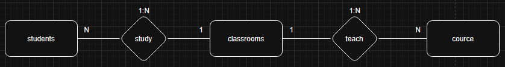
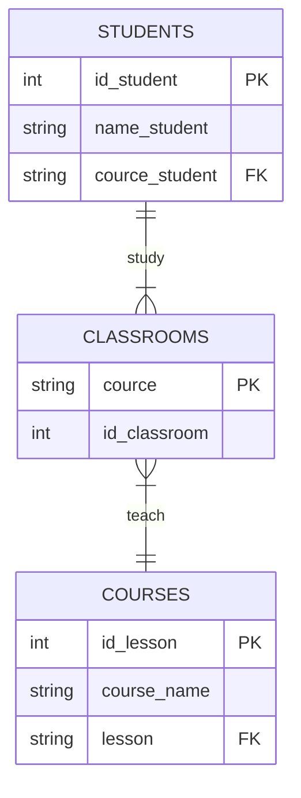

# Database Normalization

### Instructions:

- [Download the PDF](./assets/Ejercicio%201%20-%20DB.pdf) where you will find an unnormalized data table.
- Normalize the table (using Google Sheets is recommended).
- Create a Chen ER diagram.
- Create a crow’s foot diagram.
- Create a repository with the README.
- Include in the README the exercise description as well as the diagrams created (you can use Mermaid).

### Requirement:

- Normalize the provided table [see PDF](./assets/Ejercicio%201%20-%20DB.pdf).
- Using diagrams.net, create an entity-relationship diagram (Chen style).
- Using diagrams.net, create a UML diagram (Database Schema - Crow’s Foot) of the database with its tables, fields, and relationships.

### 3FN DATABASE:

#### Students

| id_student |  name_student  |    course_student |
| ---------- | :------------: | ----------------: |
| 1          |  Ana Martínez  |      Web Frontend |
| 2          | Luis Fernández |       Web Backend |
| 3          |  Carla Gómez   |      Web Frontend |
| 4          |  Diego López   | Desarrollo Mobile |
| 5          | Marta Sánchez  |       Web Backend |
| 6          | Javier Torres  |      Web Frontend |
| 7          |   Laura Ruiz   | Desarrollo Mobile |
| 8          | Pablo Ramírez  |       Web Backend |
| 9          | Sofía Navarro  |      Web Frontend |
| 10         |  Tomás Ortega  | Desarrollo Mobile |

#### CLASSROOMS:

| classroom_number | classroom_description |
| ---------------- | --------------------: |
| A101             |          Web Frontend |
| A102             |           Web Backend |
| A103             |     Desarrollo Mobile |

#### COURSES:

| id_course | classroom         |      course_name |
| --------- | ----------------- | ---------------: |
| 1         | Web Frontend      |             HTML |
| 2         | Web Frontend      |              CSS |
| 3         | Web Frontend      |       JavaScript |
| 4         | Web Backend       |             Java |
| 5         | Web Backend       | Spring Framework |
| 6         | Web Backend       |              SQL |
| 7         | Desarrollo Mobile |           Kotlin |
| 8         | Desarrollo Mobile |            Swift |
| 9         | Desarrollo Mobile |             Dart |

### Chen ER diagram:

### Crow’s foot diagram:

